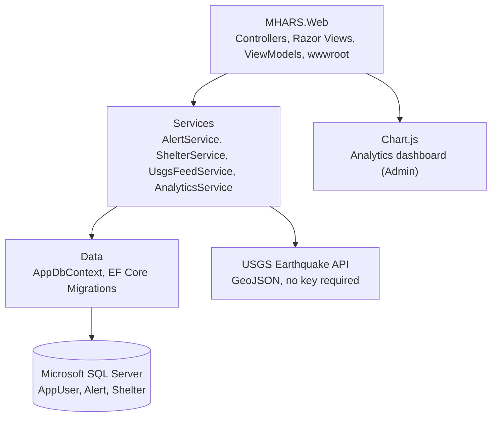

# MHARS — Architecture & Database Design

This document details the system design, single-project MVC layout, and the 3-entity relational schema.

---

## 1. System Architecture Diagram



One ASP.NET Core MVC project (`MHARS.Web`) is enough at this scale — folders substitute for the multi-project split a larger system would need:

```
MHARS.Web/
├── Controllers/     (AlertController, ShelterController, AccountController, AdminController, HomeController)
├── Models/          (AppUser, Alert, Shelter, ViewModels/)
├── Data/            (AppDbContext, Migrations/, SeedData.cs)
├── Services/        (IUsgsFeedService + UsgsFeedService, IAnalyticsService + AnalyticsService)
├── Views/           (Home/, Alert/, Shelter/, Account/, Admin/, Shared/)
└── wwwroot/         (css/, js/, lib/ — Bootstrap 5, Chart.js)
```

---

## 2. 3-Entity Data Model

### 2.1 `AppUser` (extends `IdentityUser`)
- `Id` (PK, string — Identity default)
- `FullName` (NVARCHAR(150))
- `Role` (NVARCHAR(20)) — `"Admin"` or `"Citizen"` (Identity role claim, not a raw column, but modeled here for clarity)
- `CreatedAt` (DATETIME2)

Citizen browsing (viewing alerts, shelters, safety pages) never requires a row here — it's guest access. This table only really matters for the Admin gate.

### 2.2 `Alert`
- `AlertId` (PK, INT IDENTITY)
- `HazardType` (INT / Enum: 0 = Flood, 1 = Earthquake)
- `District` (NVARCHAR(100)) — free text, matched against `Shelter.District`, **not a foreign key** (documented simplification, see Known Limitations)
- `Severity` (INT / Enum: 0 = Low, 1 = Medium, 2 = High)
- `Description` (NVARCHAR(1000), NULLABLE) — Admin's reference to the official bulletin, for flood alerts
- `Source` (INT / Enum: 0 = Manual, 1 = USGS)
- `Magnitude` (DECIMAL(3,1), NULLABLE) — earthquake only
- `Depth` (DECIMAL(6,2), NULLABLE) — earthquake only, km
- `Latitude` / `Longitude` (DECIMAL(9,6), NULLABLE) — earthquake only
- `IssuedByUserId` (FK → `AppUser.Id`, NULLABLE) — null for USGS-sourced rows
- `IssuedAt` (DATETIME2)
- `IsActive` (BIT)

### 2.3 `Shelter`
- `ShelterId` (PK, INT IDENTITY)
- `Name` (NVARCHAR(200))
- `District` (NVARCHAR(100))
- `Address` (NVARCHAR(300))
- `Capacity` (INT)
- `ContactNumber` (NVARCHAR(20))
- `ManagedByUserId` (FK → `AppUser.Id`, NULLABLE) — Admin who last edited it

Safety guidance (Do's and Don'ts) is **static content**, not a database table — it lives as Razor partials/view content (`Views/Safety/Flood.cshtml`, `Views/Safety/Earthquake.cshtml`) since it never changes at runtime. Don't add a `SafetyGuideline` table for this — it adds schema weight for content that's fixed at build time.

---

## 3. USGS Integration Flow

1. **Scheduled fetch:** `UsgsFeedService` (an `IHostedService` or a simple cache-with-expiry pattern — pick whichever the team is more comfortable implementing by Checkpoint 2) calls the USGS GeoJSON endpoint (e.g. `.../summary/significant_month.geojson` or a magnitude/time-windowed query) via `HttpClient`.
2. **Region filter:** results are filtered server-side to a South/Southeast Asia bounding box (roughly lat 20–27, long 88–93 for Bangladesh plus a margin) — a plain coordinate-range check, not a guarantee every regionally-felt tremor is captured.
3. **Upsert into `Alert`:** each qualifying USGS event is mapped to an `Alert` row with `Source = USGS`, `HazardType = Earthquake`, and `Severity` derived from magnitude (`<4.0` → Low, `4–6` → Medium, `>6` → High).
4. **Failure handling:** if the USGS call fails or times out, the last successfully cached set of earthquake alerts is shown with a "feed temporarily unavailable" notice — the page must not throw or block flood alerts from rendering (NFR-2).
5. **District view merge:** `AlertController` queries `Alert` for both `Source = Manual` (flood) and `Source = USGS` (earthquake) rows matching the selected district/region, and passes both to the same Razor view for FR-4.
